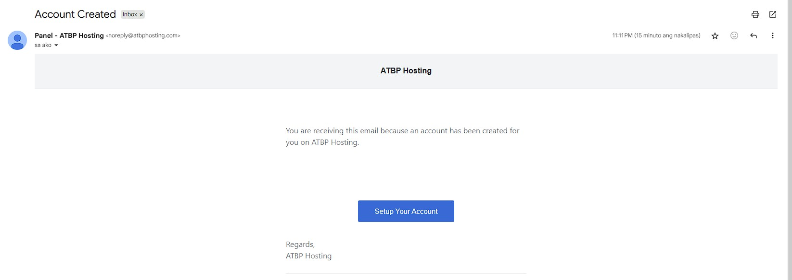

# ACCESS TO YOUR ACCOUNT

**Follow these steps to access your Service Panel Account!**

<figure><figcaption></figcaption></figure>

**To access your account, please use the email address associated with your billing account.**

For example, if you registered with a Gmail address, log in using that Gmail account.

👉 _Make sure you use the exact email you entered during registration to avoid login issues._

If you need help recovering your account, our support team is here to assist you anytime.

<figure><figcaption></figcaption></figure>

**You will receive an email from ATBP Hosting** with a **“Set Up Your Account”** button inside.

✅ Click the **Set Up Your Account** button in the email.\
✅ You will be redirected to the Panel, where you can create and confirm your new password.

If you do not see the email in your inbox, please check your spam or junk folder. For any issues, feel free to contact our support team — we’re here to help!

<figure><figcaption></figcaption></figure>
