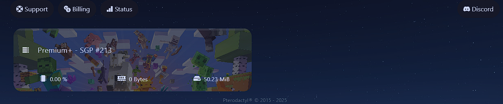
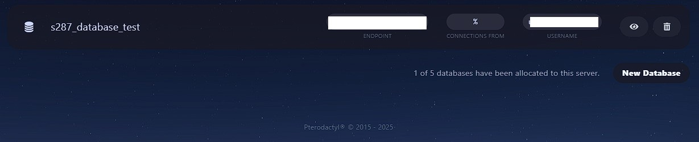

# BASIC NAVIGATIONS

## <mark style="color:blue;">ACCESSING THE PANEL</mark> 

You can access your server's main control panel [here](https://panel.atbphosting.com/). If you have multiple servers, you can choose which you want to modify from the panel page. Or, simply choose the server you want to control from the drop-down box of each page within the panel.

<figure><figcaption></figcaption></figure>

## <mark style="color:purple;">HOME</mark>

This is likely your main dashboard or overview page for the server. It typically shows basic server status (online/offline), resource usage (CPU, RAM, disk), and perhaps quick access to server actions like starting, stopping, or restarting.

<figure><figcaption></figcaption></figure>

## <mark style="color:purple;">CONSOLE</mark>

<figure><figcaption></figcaption></figure>

This is a crucial feature for server management. The terminal provides a command-line interface directly to your Minecraft server console. Here, you can:

* See server logs (e.g., player joins/leaves, chat messages, errors).
* Execute server commands (e.g., `/op <player>`, `/gamemode <player> creative`, `/save-all`, `/stop`).
* Monitor server activity in real-time.

<figure><figcaption></figcaption></figure>

## <mark style="color:purple;">FILES</mark>

<figure><figcaption></figcaption></figure>

This section allows you to manage the files and folders on your Minecraft server. You can:

* Upload and download server files (e.g., world saves, plugin JARs, configuration files like `server.properties`).
* Edit text files directly in the browser (e.g., plugin configurations, whitelist.json).
* Create, delete, and rename files/folders.
* Manage permissions for files if necessary.

<figure><figcaption></figcaption></figure>

## <mark style="color:purple;">DATABASES</mark>

<figure><figcaption></figcaption></figure>

While not always required for a basic vanilla Minecraft server, many advanced setups and plugins (like economy plugins, some claim plugins, or BungeeCord/Velocity setups) utilize databases (e.g., MySQL or SQLite) to store persistent data. This section would allow you to:

* Create and manage databases for your server.
* Create database users and set permissions.
* View database credentials for your server to connect to them.

<figure><figcaption></figcaption></figure>

## <mark style="color:purple;">SCHEDULES</mark>

<figure><figcaption></figcaption></figure>

This feature is incredibly useful for automating server tasks. You can set up schedules to:

* Automatically restart the server at specific intervals (e.g., daily at 3 AM for maintenance).
* Run backup commands at set times.
* Send warning messages to players before a scheduled restart.
* Execute other server commands periodically.

<figure><figcaption></figcaption></figure>

## USERS

<figure><figcaption></figcaption></figure>

If you have multiple people managing your Minecraft server, this section allows you to:

* Add new users to your Server panel.
* Assign specific permissions to each user (e.g., allow someone to only view the console, or give another person full file management access).

<figure><figcaption></figcaption></figure>

## <mark style="color:purple;">BACKUPS</mark>

<figure><figcaption></figcaption></figure>

This is essential for disaster recovery. The backups section allows you to:

* Create manual backups of your entire server (including world, plugins, and configurations).
* Download existing backups.
* Restore your server from a previous backup in case of data corruption or accidental deletion.

<figure><figcaption></figcaption></figure>

## <mark style="color:purple;">NETWORK ALLOCATION</mark>

<figure><figcaption></figcaption></figure>

This section typically deals with network settings for your server. For a Minecraft server, this might include:

* Viewing the assigned IP address and port.
* Managing additional ports if your server requires them for specific plugins or services (though less common for standard Minecraft).

<figure><figcaption></figcaption></figure>

## <mark style="color:purple;">STARTUP</mark>

<figure><figcaption></figcaption></figure>

This is where you configure how your Minecraft server starts up. You can:

* Select the Minecraft version or server JAR file to use.
* Set Java arguments (e.g., memory allocation `-Xmx` and `-Xms`).
* Configure specific startup parameters for your Minecraft server (e.g., `nogui`, `online-mode`).

<figure><figcaption></figcaption></figure>

## <mark style="color:purple;">SETTINGS</mark>

<figure><figcaption></figcaption></figure>

This is a general settings area for your server instance. It might include:

* Changing the server name displayed in the panel.
* Reinstalling the server software (a clean slate).
* Deleting the server.
* Other general configuration options not covered by other specific sections.

<figure><figcaption></figcaption></figure>

## <mark style="color:purple;">ACTIVITY</mark>

<figure><figcaption></figcaption></figure>

This log provides an audit trail of actions performed on your server through the Pterodactyl panel. You can see:

* Who performed what action (e.g., server started, files uploaded, commands executed).
* When the action occurred.
* This is useful for troubleshooting and monitoring user activity.

**This navigation provides a comprehensive interface for managing all aspects of a Minecraft server hosted on a ATBP HOSTING panel, from basic operations to advanced configurations and security.**
